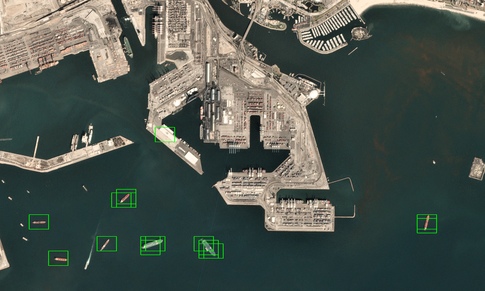

# ShipNet-Ship-Detection-in-Satellite-Images-

This project implements a ship detection system using a combination of a classification model and a sliding window technique. The dataset is divided into two parts:

1- Training Data: Used to train the classification model. For the classification phase, we trained a MobileNet model, chosen for its lightweight architecture and ability to deliver strong performance with high efficiency.

2- Scene Data: Satellite images of port areas containing ships for the detection task.

Dataset Link: https://www.kaggle.com/datasets/rhammell/ships-in-satellite-imagery

### Examples of Ship Detection
Below is an example showcasing the sliding window technique applied to detect ships in a satellite image:

.png)
